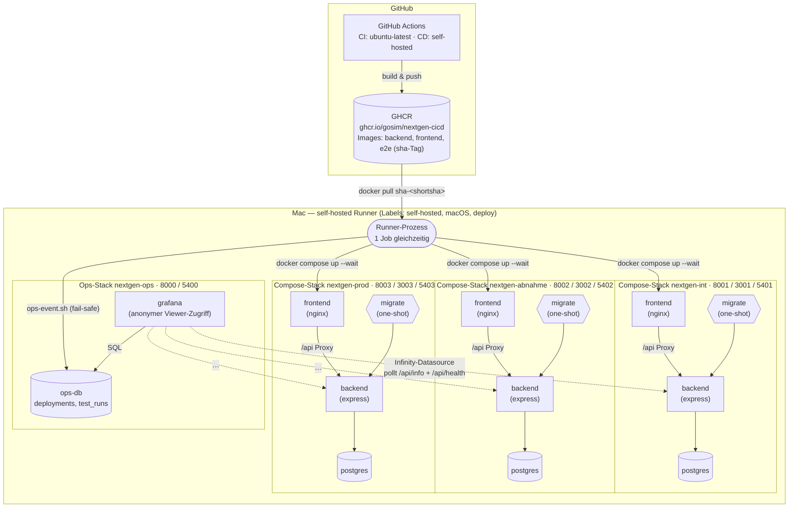
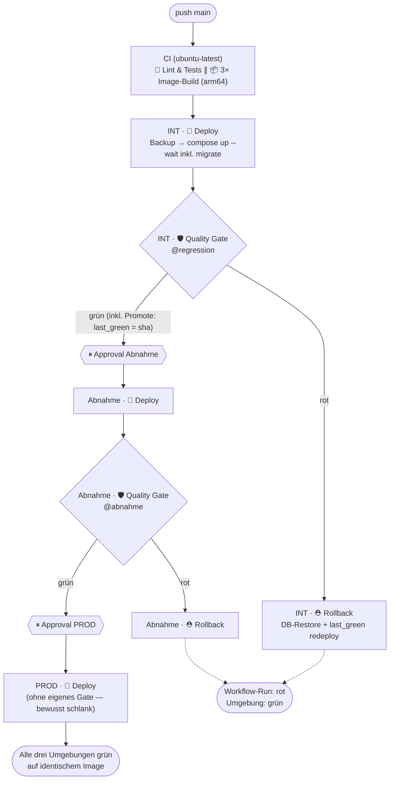

# Architektur

## Überblick

NextGen-CICD demonstriert, wie eine GitHub-Actions-Pipeline aussieht, in der Umgebungen **strukturell** grün bleiben — nicht durch Disziplin oder Konvention, sondern weil die Pipeline es technisch erzwingt.

Der Auslöser ist eine reale Erfahrung: In vielen Projekten sind Integrationsumgebungen dauerhaft rot, weil flaky Tests toleriert, Deployments trotz fehlgeschlagener Tests durchgeführt und Rollbacks — wenn überhaupt — manuell und unter Zeitdruck gefahren werden. Diese Demo zeigt das Gegenmodell:

- **Quality Gates**: E2E-Tests gegen die tatsächlich deployte Umgebung entscheiden, ob eine Version dort stehen bleibt. Keine `if: always()`-Klammer führt an einer Promotion vorbei — Beförderung ist ohne grünes Gate strukturell unmöglich (`needs`-Kette).
- **Automatischer Rollback inklusive Datenbank**: Schlägt das Gate fehl, springt derselbe Workflow-Lauf einen Rollback-Job an, der App **und** Postgres-Stand auf die letzte grüne Version zurücksetzt.
- **Sichtbares statt verstecktes Flaky-Management**: Ein Test, der erst im Retry besteht, wird nicht stillschweigend grün — er wird als „flaky" markiert, im Step Summary gemeldet und im Dashboard getrendet.

Kernbotschaft der Demo: *Eine Umgebung ist immer grün, weil eine Version, die das Gate nicht besteht, dort niemals stehen bleibt.*

## Systemarchitektur

Drei identisch aufgebaute App-Stacks (Integration, Abnahme, PROD) plus ein vierter, bewusst getrennter Ops-Stack für das Grafana-Dashboard laufen als eigenständige Docker-Compose-Projekte auf demselben Mac. Ein self-hosted GitHub-Runner ist der einzige Akteur, der auf diesem Host deployt; GitHub Actions selbst baut die Images auf gehosteten Runnern und legt sie in der GitHub Container Registry (GHCR) ab.

Jeder App-Stack besteht aus vier Services: `frontend` (nginx, proxied `/api` same-origin zum Backend, kein CORS nötig), `backend` (Express), `db` (Postgres 16 Alpine, eigenes Volume je Umgebung) und `migrate` — ein One-Shot-Service, der die Drizzle-Migrationen ausführt und danach beendet ist (`service_completed_successfully`). Der Backend-Service startet erst, wenn `migrate` erfolgreich durchgelaufen ist; das Frontend erst, wenn das Backend gesund ist. Getrennte Compose-Projektnamen (`nextgen-int`, `nextgen-abnahme`, `nextgen-prod`, `nextgen-ops`) bedeuten getrennte Netzwerke, Container **und** Volumes — die drei Umgebungen können sich unter keinen Umständen gegenseitig Daten oder Traffic zuspielen.

Der Ops-Stack ist bewusst ein eigenständiges, viertes Compose-Projekt und kein Teil der App-Stacks: Grafana pollt die laufenden Umgebungen direkt über die Infinity-Datasource gegen `http://host.docker.internal:<port>/api/info` und `/api/health` und liest Deployment-/Testlauf-Historie aus der `ops-db`. Ist der Ops-Stack aus (z. B. zwischen Demo-Terminen gestoppt), schreibt `ops-event.sh` seine Events fail-safe ins Leere (`exit 0` trotz Fehler) — das Dashboard ist nie ein Single Point of Failure für ein Deployment.

## Pipeline-Flow

Ein Push auf `main` durchläuft CI einmal und wandert dann als **dasselbe** Image durch alle drei Umgebungen. In CI laufen Tests und Image-Builds **parallel** (deployt wird nur, wenn beides grün ist). Jede Umgebungsstufe besteht aus drei sichtbaren Stationen: **🚀 Deploy** (inkl. `last_green`-Lesen und pg_dump-Backup), **🛡 Quality Gate** (E2E-Tests, bei grün direkt inkl. Promote) und **⛑ Rollback** (nur bei Rot oder Abbruch). Zwischen Integration und Abnahme sowie zwischen Abnahme und PROD steht eine manuelle GitHub-Environment-Freigabe.

PROD hat bewusst **keine eigenen Gate-/Rollback-Knoten** (übersichtlicher Graph): Was PROD erreicht, hat bereits das volle INT-Gate und das Abnahme-Gate überlebt und ist byte-identisch. Das Sicherheitsnetz für PROD sind der **stündliche Stabilitäts-Check** (read-only Smoke) und der **manuelle Rollback-Workflow**.

Technisch ist das in drei Workflows abgebildet: `pipeline.yml` (Orchestrierung, `push main` + `workflow_dispatch` mit Demo-Inputs) ruft `_ci.yml` als reusable Workflow und verkettet drei Aufrufe von `_deploy.yml` über `needs: [ci, deploy-<vorstufe>]`; die Aufrufer-Jobs heißen `CI`, `INT`, `Abnahme`, `PROD` und gruppieren den Actions-Graphen in saubere Spalten. `_deploy.yml` besteht aus `deploy → gate` plus `rollback` mit `if: failure() || cancelled()`. Die Promote-Schritte sind die letzten Steps des Gate-Jobs — sie werden nur erreicht, wenn alle Tests davor grün waren. Damit ist es strukturell unmöglich, dass eine Version ohne bestandenes Gate promoted wird.

## Mission Control (Live-Prozess-Visualisierung)

`apps/mission-control` (Container im Ops-Stack, `127.0.0.1:9100`) erzählt den Pipeline-Prozess in Echtzeit für Zuschauer: Pipeline-Band mit den laufenden Stufen und Steps, Einzeltests live (eigener Playwright-Reporter POSTet fire-and-forget an den Server — fällt Mission Control aus, laufen Gates unbeeinflusst weiter), Architektur-Karte mit pulsierenden aktiven Komponenten und animierten Datenflüssen (Backup, Rolling, Tests, Restore), Ticker mit Ereignissen in Prosa. Datenquellen: GitHub-Actions-API (Runs/Jobs/Steps/Approvals, fine-grained PAT nur lokal in `~/deployments/mission-control.env`), die Umgebungs-Endpoints (`/api/info`, `/api/health`) und die Ops-DB. Die **Demo-Steuerung** startet alle Szenarien (`workflow_dispatch`) und erteilt wartende Freigaben direkt aus der App — Arbeitsteilung: Mission Control = Prozess-Echtzeit, Grafana = Metriken & Historie.

## Stabilitäts-Monitoring (stündlich)

Ergänzend zu den Deployment-Gates führt `stability-check.yml` **stündlich** (Cron, UTC) die drei Gate-Suiten gegen die laufenden Umgebungen aus — INT volle Regression, Abnahme Kernprozesse, PROD read-only Smoke, jeweils mit der aktuell deployten Version aus dem State-File. Ergebnisse fließen mit `source='stability'` in die Ops-DB und erscheinen in Grafana als Stabilitäts-Bänder pro Umgebung (grün/gelb/rot) inkl. klickbarem Testreport-Link. Ein roter Check bedeutet Signal, nicht Rollback: Es wurde nichts deployt — Instabilität zwischen Deployments ist eine Betriebs-Erkenntnis. Betriebsdetails: Läufe stauen sich bei offline-Runner, `concurrency: cancel-in-progress` lässt nur den neuesten laufen; GitHub pausiert Schedules nach 60 Tagen Repo-Inaktivität.

## Skalierung & unterbrechungsfreie Deployments

Jede Umgebung betreibt **2 Replicas** von Frontend und Backend hinter einem Edge-Proxy (nginx), der als einziger die Host-Ports publisht und über die Docker-DNS (`resolver 127.0.0.11`, Re-Resolution alle 5 s) auf alle gesunden Replicas verteilt. Deployments laufen **rolling** (`deploy.sh`): Migration als One-Shot zuerst (Expand/Contract-Prinzip: Schema muss während der Übergangsphase mit alter und neuer Version kompatibel sein), dann je Service 2 neue Replicas zusätzlich starten, auf deren Health warten, alte entfernen — zu jedem Zeitpunkt bedienen gesunde Instanzen den Traffic. Schlägt die neue Version beim Healthcheck fehl, werden nur die neuen Replicas entfernt und die alten laufen unverändert weiter (sicherer Abbruch). Derselbe Mechanismus macht auch Rollbacks unterbrechungsfrei. `GET /api/info` liefert das Feld `instance` (Container-Hostname) — zwei aufeinanderfolgende Aufrufe zeigen das Load-Balancing live.

## Build once, deploy many

Images werden **genau einmal** gebaut — im `ci`-Job von `pipeline.yml`, ausschließlich beim Push auf `main`. Der Tag ist der kurze Git-SHA (`sha-<shortsha>`, `git rev-parse --short=7 HEAD`), unveränderlich und eindeutig einem Commit zugeordnet. Backend, Frontend und E2E-Image werden mit demselben Tag parallel gebaut und nach GHCR gepusht (`ghcr.io/gosim/nextgen-cicd/{backend,frontend,e2e}:sha-<shortsha>`).

Genau dieses Image — byte-identisch, kein Rebuild — durchläuft anschließend INT, Abnahme und PROD. Umgebungsidentität ist **niemals** ein Build-Artefakt, sondern reine Laufzeit-Konfiguration: `APP_ENV`, Ports, `DATABASE_URL` und Demo-Flags (`DEMO_BUG`, `DEMO_FLAKY`) kommen aus dem jeweiligen `deploy/env/<env>.env`-File bzw. werden dem Compose-Stack als Environment-Variable übergeben.

**Die Vite-Falle**: Vite backt `VITE_*`-Variablen zur **Buildzeit** ins Bundle ein. Ein Frontend, das seinen Umgebungsnamen aus einer `VITE_APP_ENV` bezöge, müsste für jede Umgebung neu gebaut werden — das widerspricht „build once, deploy many" fundamental und wäre außerdem falsch, sobald ein Image befördert wird (INT-Build liefe fälschlich mit „PROD"-Label). Deshalb holt sich das Frontend Umgebungsname und Version ausschließlich **zur Laufzeit** von `GET /api/info` (`{version, gitSha, environment, buildTime, demoBug}`) und zeigt sie im farbcodierten Environment-Badge (INT blau, Abnahme orange, PROD grün) sowie im Versions-Badge im Header an. `APP_VERSION`, `GIT_SHA` und `BUILD_TIME` selbst sind zwar Build-Args (sie beschreiben ja das Artefakt, nicht die Umgebung), `APP_ENV` ist strikt ein Laufzeit-Wert.

## State-Tracking

Der operative „Wahrheits"-Zustand jeder Umgebung liegt bewusst **nicht** primär in GitHub, sondern in einer lokalen JSON-Datei auf dem Runner-Host: `~/deployments/state/<env>.json`, verwaltet über `deploy/scripts/state.sh get|set`. Drei Schlüssel:

| Schlüssel | Bedeutung |
|---|---|
| `current` | Image-Tag, der aktuell in der Umgebung läuft (unabhängig davon, ob das Gate bestanden hat) |
| `last_green` | Letzter Image-Tag, der das Gate bestanden hat — einziges gültiges Rollback-Ziel |
| `last_backup` | Pfad zum zuletzt erstellten `pg_dump`-Backup dieser Umgebung |

Diese Datei liegt außerhalb des Runner-`_work`-Verzeichnisses und übersteht damit Workspace-Cleanups. Der entscheidende Designgrund: **Rollback funktioniert ohne GitHub-API-Zugriff.** Selbst wenn GitHub nicht erreichbar wäre, weiß der Host genau, welche Version zuletzt grün war und wo das passende DB-Backup liegt.

Die zweite Ebene ist reine **Sichtbarkeit**: Jeder `deploy`-Job erzeugt über die GitHub-Deployments-API einen Eintrag (`in_progress` → `success`/`failure`), sichtbar auf der Repo-Seite „Environments". Dort sieht man live, welcher Commit gerade auf welcher Umgebung läuft — der Demo-Effekt, der in Akt 1 des Runbooks genutzt wird, um alle drei Umgebungen synchron auf derselben Version zu zeigen.

## Artefakt-Ablagen: Wo Versionen und Backups liegen

Das Wiederherstellungs-Konzept verteilt sich auf **vier Ablageorte mit klaren Rollen** — Leitprinzip: *Deploy-Artefakte ins Registry (unveränderlich, versioniert), Betriebszustand und Daten-Backups lokal beim Deploy-Ziel (rollback-schnell, netzunabhängig), Analyse-Artefakte am CI-Lauf.*

| Ablage | Ort | Inhalt & Rolle |
|---|---|---|
| **Artifact-Repository (GHCR)** | `ghcr.io/gosim/nextgen-cicd/{backend,frontend,e2e}:sha-<commit>` | Jede jemals gebaute App-Version als unveränderliches Docker-Image („build once"). Tags werden nie überschrieben; jede Version ist per SHA eindeutig einem Commit zuordenbar und jederzeit erneut deploybar |
| **Lokaler Image-Cache + `green-<env>`-Pins** | Docker-Cache des Runner-Hosts | Der Promote-Schritt taggt die zuletzt grüne Version zusätzlich lokal als `green-int\|abnahme\|prod`. Doppelte Absicherung: Rollback funktioniert auch ohne Registry-Zugriff, und `docker prune` kann das Rollback-Ziel nicht wegräumen |
| **DB-Dumps** | `~/deployments/backups/<env>/<zeitstempel>_<version>.dump` | `pg_dump -Fc` vor **jedem** Deployment (im 🚀-Deploy-Job, nach der Approval-Freigabe — also maximal frisch), Retention: letzte 10 pro Umgebung. Bewusst lokal statt remote: Beim Rollback zählt Sekunden-schneller Zugriff ohne Netzabhängigkeit, und Datenbank-Inhalte gehören nicht in eine Registry |
| **GitHub Actions Artifacts** | am jeweiligen Workflow-Run (14 Tage) | Playwright-HTML-Report, Traces, Videos, Screenshots jedes Gate-Laufs — die Analyse-Artefakte für den Trace-Viewer, nicht fürs Deployment |

Der Rollback bedient sich daraus in dieser Reihenfolge: `state.sh` liefert `last_green` + `last_backup` → `restore.sh` spielt den Dump ein → `deploy.sh` startet die `last_green`-Version (Image aus lokalem Cache, Fallback GHCR).

**Ausbaustufe für den Enterprise-Einsatz:** DB-Dumps zusätzlich in einen Objektspeicher (S3, Azure Blob o. ä.) replizieren, damit Backups auch einen Totalausfall des Deploy-Hosts überleben; für Images ggf. eine Registry mit Retention-Policies und Signierung (cosign). Für die Demo bewusst schlank gehalten.

## Rollback-Mechanik

Schlägt das Gate fehl, übernimmt der `rollback`-Job in `_deploy.yml` (identischer Ablauf in `rollback-manual.yml` für den manuellen Notfallhebel). Die Reihenfolge ist kritisch — jeder Schritt existiert, weil der vorherige ihn erzwingt:

1. **Backend stoppen** (`docker compose stop backend`) — unterbindet neue DB-Connections, bevor irgendetwas an der Datenbank verändert wird.
2. **`pg_terminate_backend`** für alle verbleibenden Connections zur Datenbank `app` (außer der eigenen Restore-Session) — ohne diesen Schritt lehnt Postgres den Restore mit „database is being accessed by other users" ab.
3. **`pg_restore --clean --if-exists`** aus dem Pre-Deploy-Backup (`~/deployments/backups/<env>/<timestamp>_<sha>.dump`, das der Deploy-Job **vor** dem fehlerhaften Ausrollen angelegt hat) — `--clean --if-exists` räumt vorhandene Objekte idempotent weg, bevor sie neu eingespielt werden.
4. **`compose up` mit `last_green`** als `IMAGE_TAG` — das Image liegt lokal im Cache (gepinnt über einen zusätzlichen `green-<env>`-Tag, der im `promote`-Job gesetzt wird, damit `docker prune` es nicht wegräumt), ein Registry-Pull ist nicht erforderlich. Anschließend Healthcheck-Wait wie bei jedem regulären Deploy.
5. **State- und Sichtbarkeits-Update**: `state.sh set <env> current=<last_green>`, GitHub-Deployment-Status `failure` (der Workflow-Run bleibt rot — das ist gewollt: er transportiert die Information „hier gab es ein Problem"), Job-Summary mit Vorher/Nachher-Tabelle, Ops-Event `rolled_back` an die Ops-DB (erscheint in Grafana rot markiert).

Für den **Bootstrap-Fall** — das allererste Deployment einer Umgebung scheitert, es gibt noch kein `last_green` — bricht der Rollback nicht mit einem Crash ab: Der Stack wird gestoppt, eine Warnung ausgegeben, kein Restore versucht. Genau dieses Ergebnisbild ist die Kern-Demo-Botschaft: **Der Workflow-Run ist rot — die Umgebung ist grün.** Eine fehlerhafte Version wurde weder promoted noch bleibt sie stehen.

## Port-Matrix

| Umgebung | Compose-Projekt | Frontend | API | Postgres | Approval |
|---|---|---|---|---|---|
| Integration | `nextgen-int` | 8001 | 3001 | 5401 | automatisch |
| Abnahme | `nextgen-abnahme` | 8002 | 3002 | 5402 | Required Reviewer |
| PROD | `nextgen-prod` | 8003 | 3003 | 5403 | Required Reviewer |
| Ops (Grafana) | `nextgen-ops` | 8000 | — | 5400 (ops-db) | — |

Start je Umgebung: `docker compose -p nextgen-<env> --env-file deploy/env/<env>.env -f deploy/compose/docker-compose.yml up -d --wait`. Der Ops-Stack läuft separat über `deploy/compose/docker-compose.ops.yml`.

## Sicherheitsprinzip: self-hosted Runner nur für CD, nur auf `main`

Ein self-hosted Runner auf dem eigenen Mac ist ein reales Sicherheitsrisiko, wenn Fremdcode darauf ausgeführt werden kann — deshalb ist die Trennung strikt:

- **`pr.yml`** (Pull Requests) ruft ausschließlich `_ci.yml` auf und läuft **komplett auf `ubuntu-latest`** (GitHub-hosted). PR-Code — potenziell von außen — kommt niemals auf den self-hosted Runner, auch nicht lesend.
- **`_ci.yml`** läuft ebenfalls immer auf `ubuntu-latest`, unabhängig davon, ob es von `pr.yml` oder von `pipeline.yml` aufgerufen wird. Lint, Typecheck, Tests und Image-Build passieren nie auf dem Deploy-Host.
- **`_deploy.yml`** und **`rollback-manual.yml`** laufen ausschließlich auf `[self-hosted, macOS, deploy]` — und werden ausschließlich von `pipeline.yml` erreicht, dessen Push-Trigger auf `branches: [main]` beschränkt ist. `workflow_dispatch` erfordert Schreibrechte auf das Repo. Auf dem self-hosted Runner läuft also nie ungeprüfter PR-Code, sondern immer nur bereits nach `main` gemergter, durch `_ci.yml` bereits geprüfter Code.
- **Ein Runner, ein Job gleichzeitig**: Der self-hosted Runner nimmt pro Zeitpunkt nur einen Job an. In Kombination mit den Concurrency-Gruppen (`cd-pipeline` auf Pipeline-Ebene, `deploy-<env>` pro Umgebung, `cancel-in-progress: false` für laufende Deploy-/Rollback-Jobs) serialisieren sich Deployments automatisch — es kann nie ein Rollback mitten in einem laufenden Deploy derselben Umgebung stehen.

Hinweis zur Sichtbarkeit: Dieses Demo-Repo ist bewusst **öffentlich**, weil Environment-Protection-Rules (Required Reviewers — die Approval-Gates) im GitHub-Free-Plan nur für öffentliche Repos verfügbar sind. Abgesichert ist das über zwei Regeln: Workflow-Läufe von Fork-PRs erfordern immer manuelle Freigabe, und der self-hosted Runner führt ausschließlich CD-Jobs bei Push auf `main` aus (nie PR-Code). Für den produktiven Nachbau mit GitHub Pro/Team/Enterprise: Repository privat halten — die Protection Rules funktionieren dort auch privat.
